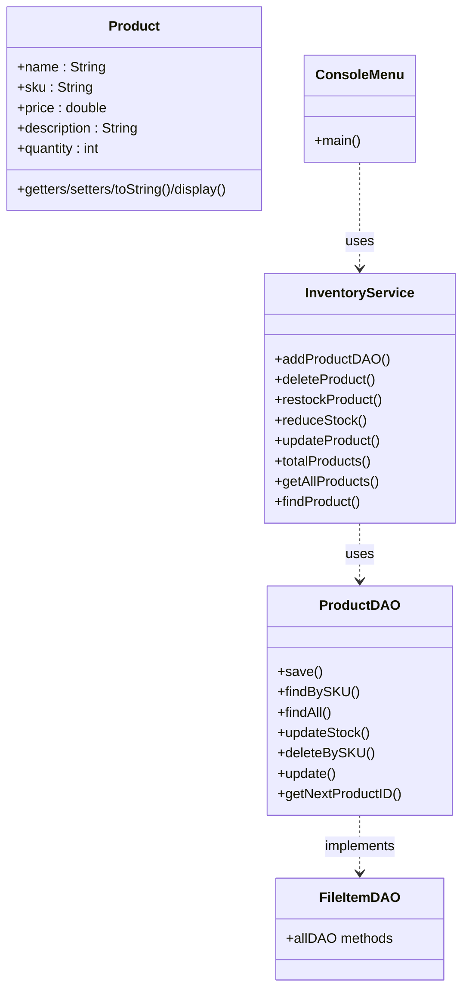

```mermaid
classDiagram
    class ProductDAO {
        +save()
        +findBySKU()
        +findAll()
        +updateStock()
        +deleteBySKU()
        +update()
        +getNextProductID()
    }
    class Product {
        +name : String
        +sku : String
        +price : double
        +description : String
        +quantity : int
        +getters/setters/toString()/display()
    }
    class FileItemDAO {
        +allDAO methods
    }
    class InventoryService {
        +addProductDAO()
        +deleteProduct()
        +restockProduct()
        +reduceStock()
        +updateProduct()
        +totalProducts()
        +getAllProducts()
        +findProduct()
    }
    class ConsoleMenu {
        +main()
    }

    ProductDAO ..> FileItemDAO : implements
    InventoryService ..> ProductDAO : uses
    ConsoleMenu ..> InventoryService : uses
```